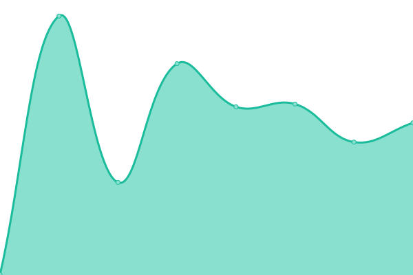

# [📈 Live Status](https://status.ibugone.com): <!--live status--> **🟩 All systems operational**

This repository contains the open-source uptime monitor and status page for [iBot](https://ibugone.com/), powered by [Upptime](https://github.com/upptime/upptime).

With [Upptime](https://upptime.js.org), you can get your own unlimited and free uptime monitor and status page, powered entirely by a GitHub repository. We use [Issues](https://github.com/iBug-Bot/status/issues) as incident reports, [Actions](https://github.com/iBug-Bot/status/actions) as uptime monitors, and [Pages](https://status.ibugone.com) for the status page.

<!--start: status pages-->
<!-- This summary is generated by Upptime (https://github.com/upptime/upptime) -->
<!-- Do not edit this manually, your changes will be overwritten -->
<!-- prettier-ignore -->
| URL | Status | History | Response Time | Uptime |
| --- | ------ | ------- | ------------- | ------ |
|  [Home Page](https://ibug.io/) | 🟩 Up | [home-page.yml](https://github.com/iBug-Bot/status/commits/HEAD/history/home-page.yml) | 

 199ms
     
 | 

<a href="https://status.ibugone.com/history/home-page">100.00%</a>
    

|  [Notes](https://notes.ibug.io/) | 🟩 Up | [notes.yml](https://github.com/iBug-Bot/status/commits/HEAD/history/notes.yml) | 

 230ms
     
 | 

<a href="https://status.ibugone.com/history/notes">100.00%</a>
    

|  [GitHub Webhook Receiver](https://api.ibugone.com/gh/_status) | 🟩 Up | [git-hub-webhook-receiver.yml](https://github.com/iBug-Bot/status/commits/HEAD/history/git-hub-webhook-receiver.yml) | 

 1169ms
     
 | 

<a href="https://status.ibugone.com/history/git-hub-webhook-receiver">100.00%</a>
    

|  [Public Files](https://b2.ibugone.com/) | 🟩 Up | [public-files.yml](https://github.com/iBug-Bot/status/commits/HEAD/history/public-files.yml) | 

 402ms
     
 | 

<a href="https://status.ibugone.com/history/public-files">100.00%</a>
    

|  [Local Files](https://ustc-files.ibugone.com/) | 🟩 Up | [local-files.yml](https://github.com/iBug-Bot/status/commits/HEAD/history/local-files.yml) | 

 11406ms
     
 | 

<a href="https://status.ibugone.com/history/local-files">97.48%</a>
    

|  [TaoKY Strong](https://taokystrong.com/) | 🟩 Up | [tao-ky-strong.yml](https://github.com/iBug-Bot/status/commits/HEAD/history/tao-ky-strong.yml) | 

 1129ms
     
 | 

<a href="https://status.ibugone.com/history/tao-ky-strong">100.00%</a>
    

<!--end: status pages-->

[**Visit our status website →**](https://status.ibugone.com)

## 📄 License

- Powered by: [Upptime](https://github.com/upptime/upptime)
- Code: [MIT](./LICENSE) © [iBot](https://ibugone.com/)
- Data in the `./history` directory: [Open Database License](https://opendatacommons.org/licenses/odbl/1-0/)
